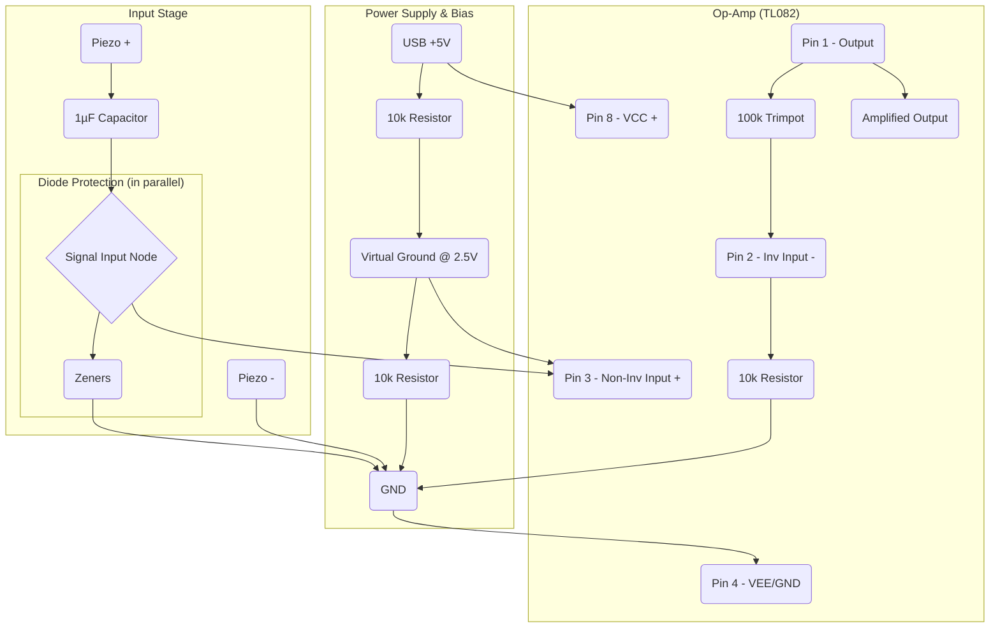

# RecPadroes-Voz

```mermaid
graph TD
    subgraph "Power Supply & Bias"
        USB_5V(USB +5V) --> R1(10k Resistor)
        R1 --> V_REF(Virtual Ground @ 2.5V)
        V_REF --> R2(10k Resistor)
        R2 --> GND(GND)
    end

    subgraph "Input Stage"
        Piezo_P(Piezo +) --> C1(1µF Capacitor)
        C1 --> InputNode{Signal Input Node}
        Piezo_N(Piezo -) --> GND
        subgraph "Diode Protection (in parallel)"
            InputNode --> Diodes(Zeners)
            Diodes --> GND
        end
    end

    subgraph "Op-Amp (TL082)"
        %% Power Connections
        USB_5V --> Pin8(Pin 8 - VCC +)
        GND --> Pin4(Pin 4 - VEE/GND)

        %% Signal Input
        InputNode --> Pin3(Pin 3 - Non-Inv Input +)
        V_REF --> Pin3

        %% Feedback Loop
        Pin1(Pin 1 - Output) --> RV1(100k Trimpot)
        RV1 --> Pin2(Pin 2 - Inv Input -)
        Pin2 --> R3(10k Resistor)
        R3 --> GND
        
        %% Final Output
        Pin1 --> Amplified_Out(Amplified Output)
    end
```
' 
